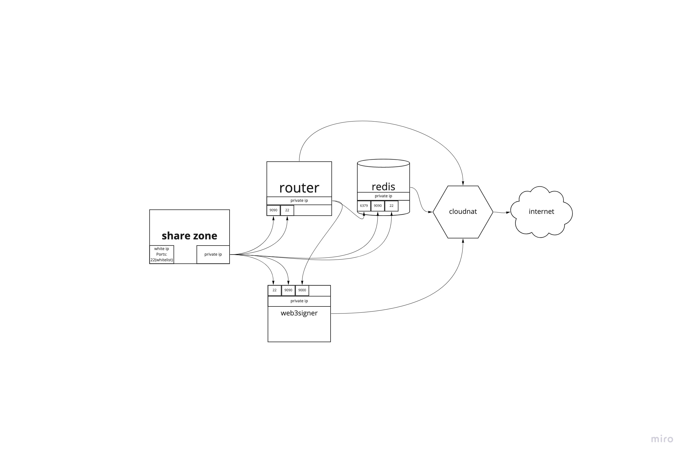

# Architecture



All instances except `share-zone` will be in the private network. You can use `share-zone` instance like bastion host.

Don't use `ForwardAgent=yes` for accessing bastion host instead use it as [jump-box](http://www.linux-magazine.com/Online/Features/Jump-Box-Security) `-J` flag for ssh.

You can see all firewall rules [here](modules/amarok/firewall.tf)

---

# Basic info

Using this repo you can create infrastructure for the [connext router](https://connextscan.io) in the [GCP](https://cloud.google.com/gcp)

Currently only for `amarok testnet`

This is a simple terraform configs, for full description of each entity you can check [this](./modules/amarok/README.md)

---

# Basic setup

- Create a `GCP` project.

- Get `Service Account` key in `json` format. You can read about `Service Accounts` [here](https://cloud.google.com/iam/docs/creating-managing-service-account-keys). The best way to store `Service Account` key is to use [encfs](https://github.com/vgough/encfs) or [LUKS](https://www.redhat.com/sysadmin/disk-encryption-luks) encrypted volume.

- Export your `Service Account` key like this:

  `export GOOGLE_APPLICATION_CREDENTIALS=/super-encrypted-volume/project-name-some-hash.json`

- Create `bucket` with name like `connext-amarok-testnet-state-bucket`. This name must be globally unique. You can use [this](https://cloud.google.com/storage/docs/creating-buckets) guide for creating buckets. **Don't forget to make bucket private**

- Update `backend.tf` with your bucket name

- Copy [amarok.tfvars.example](./amarok.tfvars.example) to `amarok.tfvars` and [ssh-keys.tf.example](./ssh-keys.tf.example) to `ssh-keys.tf`

  `cp amarok.tfvars.example amarok.tfvars ; cp ssh-keys.tf.example ssh-keys.tf`

- Now you need to change values in `amarok.tfvars` depending on your setup:

  **Requried**

  `project_name`  - should contain yours project name in `GCP`. More info [here](https://cloud.google.com/resource-manager/docs/creating-managing-projects)

  `region`        - region for your project. More info [here](https://cloud.google.com/compute/docs/regions-zones)

  **Optional**

  `network_name`  - name for the network where all instances will be. More info [here](https://cloud.google.com/vpc/docs/vpc)

  `cloudnat_name` - name for `cloud-nat`. More info [here](https://cloud.google.com/nat/docs/overview)

  `source_ranges` - whitelisted ips which can access `share-zone` instances.

  `availability_zone_name` - use only zone prefixes, like `a`, `b` or `c` More info [here](https://cloud.google.com/compute/docs/regions-zones)

  `machine_type`           - machine type, you can test different setups to decide which one is better in terms of price and perfomance. More info [here](https://cloud.google.com/compute/docs/machine-types)

  `disk_size`              - root disk size.

  `disk_type`              - root disk type, you can also test different setups to decide which one is better in terms of price and perfomance.

  `image_type`             - boot image. More info [here](https://cloud.google.com/compute/docs/images)

  **Optional (Redis)**

  `name`                   - Redis cluster name

  `tier`                   - HA/non-HA setup. Possible values are `STANDARD_HA` and `BASIC`

  `primary_az`             - AZ for primary Redis node

  `secondary_az`           - AZ for secondary Redis node

  `redis_version`          - Redis engine version e.g. `REDIS_6_X`

  `memory_size_gb`         - Redis memory size in GB. Can be whole number only.

- Add your SSH keys to`ssh-keys.tf` . These SSH keys will be used for accessing instances via ssh.

  ```
  variable "ssh_keys" {
    default = <<EOT
  user_name:ssh-ed25519 user_public_key info_about_key
  user_name_2:ssh-ed25519 user_public_key info_about_key
  EOT
  }
  ```

- Enable GCP hosted Redis usage [here](https://console.developers.google.com/apis/api/redis.googleapis.com/overview)

- Init terraform

  `terraform init`

- Apply terraform

  `terraform apply -var-file=amarok.tfvars`

- All ip address for instances will be in the terraform output

- For Destroying infra you can use

  `terraform destroy -var-file=amarok.tfvars`

## GCP prices

[Here](https://cloudpricingcalculator.appspot.com) you can get price for you `GCP` infra.
